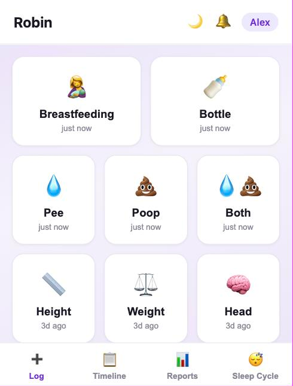
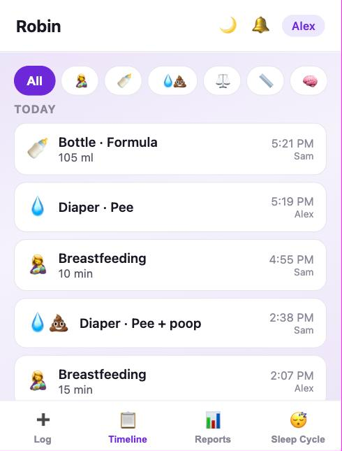
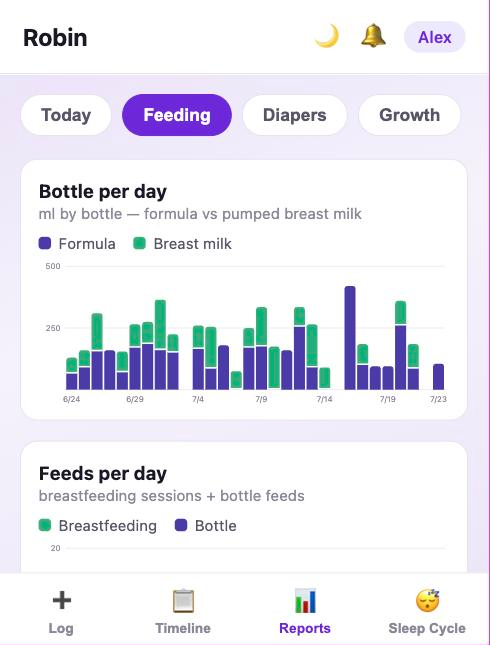
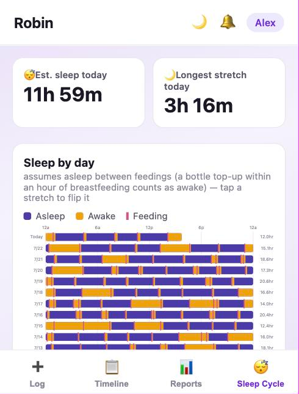

# Baby Tracker

A tiny self-hosted PWA for two parents to track a newborn: breastfeeding,
formula (ml), diapers, weight, and timestamped photos — with day-by-day
reports and a push-notification nudge if nothing has been logged for a while.

One Node.js process serves the app, owns a SQLite database, stores photos on
disk, and runs the nudge checker. No accounts, no third-party services.

## Screenshots

> **All screenshots are anonymized.** Every name, date, and measurement shown
> is synthetic — they come from a throwaway database seeded by
> `scripts/seed-demo-data.js` and a demo-only config, never from a real
> family's data. See [Demo data](#demo-data-for-screenshots).

<table>
  <tr>
    <td width="50%"></td>
    <td width="50%"></td>
  </tr>
  <tr>
    <td align="center"><b>Log</b></td>
    <td align="center"><b>Timeline</b></td>
  </tr>
  <tr>
    <td width="50%"></td>
    <td width="50%"></td>
  </tr>
  <tr>
    <td align="center"><b>Reports</b></td>
    <td align="center"><b>Sleep cycle</b></td>
  </tr>
</table>

## Privacy

This repo is public; **no personal data lives in it**. Names, emails, and the
shared login secret are supplied via environment variables (`.env` locally —
gitignored — or Fly secrets in production). The database and photos live on a
private volume, and photos are only served behind login.

## Local development

```sh
npm install
npm run make-icons   # once, generates public/icons/*.png
cp .env.example .env # optional — every key has a usable dev default
npm start            # http://localhost:3000
```

Configuration is read from `.env`; `.env.example` documents every key, and the
table at the bottom of this file has the full reference. The default login
secret in dev is `baby`.

### Demo data (for screenshots)

The screenshots above were produced from a disposable instance with an
entirely synthetic database — no real data is involved at any point:

```sh
SCRATCH=/tmp/bt-demo && mkdir -p $SCRATCH
cat > $SCRATCH/demo.env <<EOF
USER_NAMES=Alex,Sam
BABY_NAME=Robin
BIRTH_DATE=2026-05-02
BABY_SEX=girl
APP_SECRET=demo
DATA_DIR=$SCRATCH/demo-data
PORT=3100
EOF
SEED_DIR=$SCRATCH/demo-data SEED_BIRTH=2026-05-02 \
  SEED_NOW=2026-07-23T15:40:00-07:00 node scripts/seed-demo-data.js
node --env-file=$SCRATCH/demo.env server/index.js   # http://localhost:3100
```

`scripts/seed-demo-data.js` generates about two months of plausible feeds,
diapers, weekly growth measurements and milestones from a seeded PRNG, so
re-running it reproduces the same screenshots. It refuses to write to a live
`DATA_DIR`, and `--env-file=` (rather than `npm start`) keeps your real
`.env` out of the demo process.

## Deploying to Fly.io

```sh
cp fly.toml.example fly.toml           # set your app name + region (stays local)
fly apps create your-app-name
fly volumes create data --size 1 --region <region> -a your-app-name
npx web-push generate-vapid-keys       # for push notifications
fly secrets set -a your-app-name \
  APP_SECRET="your-family-secret" \
  USER_NAMES="Mom,Dad" \
  BABY_NAME="..." \
  BIRTH_DATE="YYYY-MM-DD" \
  BABY_SEX="girl" \
  VAPID_SUBJECT="mailto:you@example.com" \
  VAPID_PUBLIC_KEY="..." \
  VAPID_PRIVATE_KEY="..."
fly deploy --ha=false
```

Then on each iPhone: open the app URL in Safari → Share → **Add to Home
Screen** → open it from the home screen → log in → tap 🔔 to enable nudges.

## Monitoring

`GET /api/health` returns `{"ok":true}` when the app is up and its database is
readable, and `503` otherwise. It runs a one-row SQLite query rather than just
confirming the process is alive — a machine whose volume failed to mount will
happily serve pages while every real request fails. It requires no login and
returns nothing personal, so it is safe to point a public monitor at.

Two things should watch it:

1. **Fly** — `fly.toml.example` includes an `[[http_service.checks]]` block that
   polls it every 30s and restarts the machine when it fails.
2. **An external uptime monitor** — [UptimeRobot](https://uptimerobot.com) or
   [Healthchecks.io](https://healthchecks.io), free tier, pointed at
   `https://your-app.fly.dev/api/health`. This is the one that actually reaches
   you: if the machine or the whole region is down, Fly's internal check has no
   way to send you an alert.

```sh
curl -s https://your-app.fly.dev/api/health   # {"ok":true}
```

## Backups

Three layers:

1. **Fly volume snapshots** — automatic, daily, 30-day retention
   (`fly volumes update <vol-id> --snapshot-retention 30`). Restore with
   `fly volumes create data --snapshot-id <id>`.
2. **Off-site export** — `GET /api/export` streams a tar.gz of the SQLite
   database + all photos. Authenticated by login cookie or
   `Authorization: Bearer <APP_SECRET>`.
3. **Pull script** — `scripts/backup.sh` downloads an export and keeps the
   newest 30 locally:
   ```sh
   APP_URL=https://your-app.fly.dev APP_SECRET=... ./scripts/backup.sh
   ```
   Run it on a schedule (cron/launchd) for continuous off-site copies.

## Voice logging (optional)

`POST /api/voice` takes a dictated sentence in English or Mandarin, parses it
with Claude, saves the events, and returns a short spoken confirmation — so a
parent can say "Hey Siri, Log Baby" and log a feed without touching anything.
It needs `ANTHROPIC_API_KEY` plus its own `VOICE_TOKEN`
(`fly secrets set -a your-app-name --stage VOICE_TOKEN="..."`, then deploy);
with `VOICE_TOKEN` unset the endpoint is off. The token is deliberately
separate from `APP_SECRET` and can only create events, never read or export.
See [docs/siri-voice-logging.md](docs/siri-voice-logging.md) to build the
Shortcut.

## Environment variables

| Var | Default | Purpose |
|---|---|---|
| `APP_SECRET` | `baby` (dev only) | shared login secret — set a real one in prod |
| `USER_NAMES` | `Mom,Dad` | comma-separated parent names shown at login |
| `BABY_NAME` | `Baby` | baby's name (private, env-only) |
| `APP_NAME` | falls back to `BABY_NAME` | app title + home-screen name |
| `BIRTH_DATE` | unset | baby's birth date (YYYY-MM-DD); enables growth percentiles |
| `BABY_SEX` | unset | `boy` or `girl`; selects the WHO growth-standards table |
| `HOME_TZ` | `America/Los_Angeles` | day boundaries for reports |
| `NUDGE_HOURS` | `6` | push a nudge after this many hours with no entries |
| `RENUDGE_MINUTES` | `60` | re-nudge interval while still quiet |
| `DATA_DIR` | `./data` | where SQLite + photos live (`/data` on Fly) |
| `VAPID_PUBLIC_KEY` / `VAPID_PRIVATE_KEY` / `VAPID_SUBJECT` | auto-generated in dev | web-push credentials |
| `COOKIE_SECRET` | derived from `APP_SECRET` | cookie signing key |
| `ANTHROPIC_API_KEY` | unset | enables the auto-generated Claude analysis of diaper photos and voice logging; without it, photos still work and analysis is skipped |
| `VOICE_TOKEN` | unset | bearer token for `POST /api/voice` (hands-free Siri logging — see [docs/siri-voice-logging.md](docs/siri-voice-logging.md)); unset disables the endpoint |
