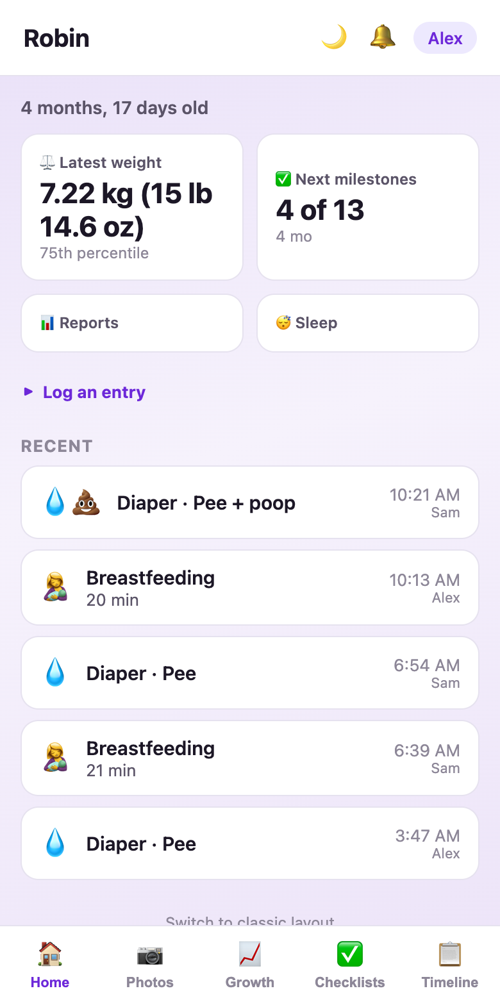
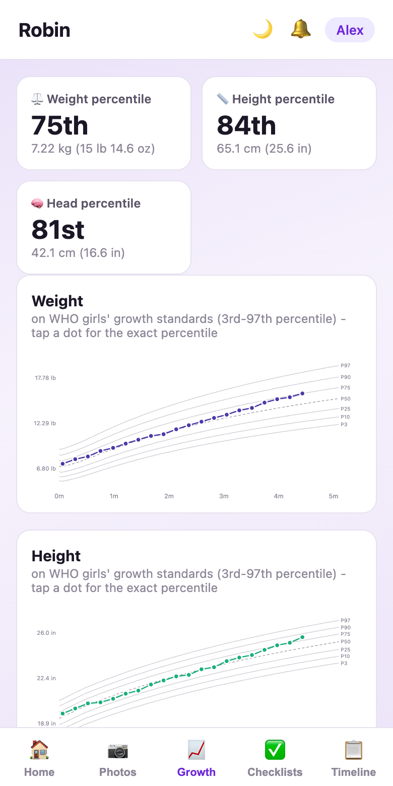
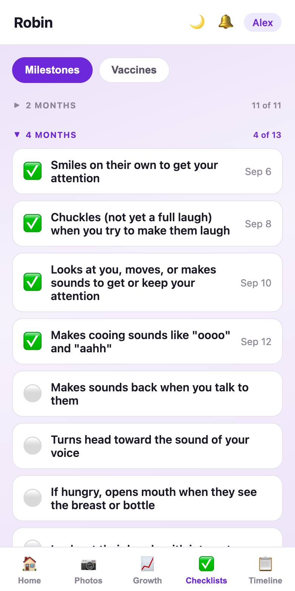
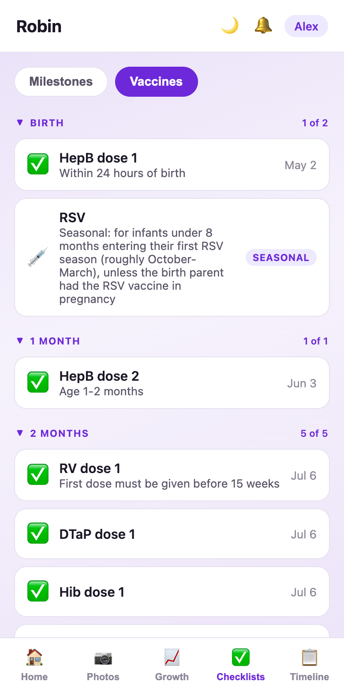
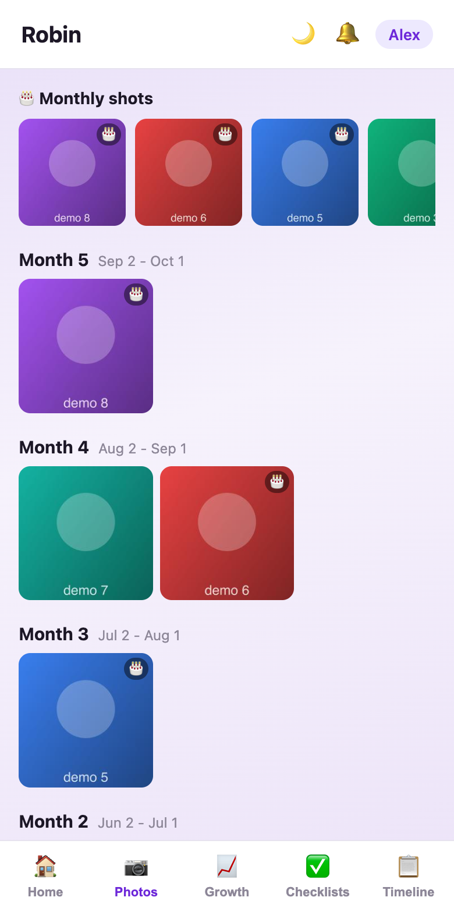
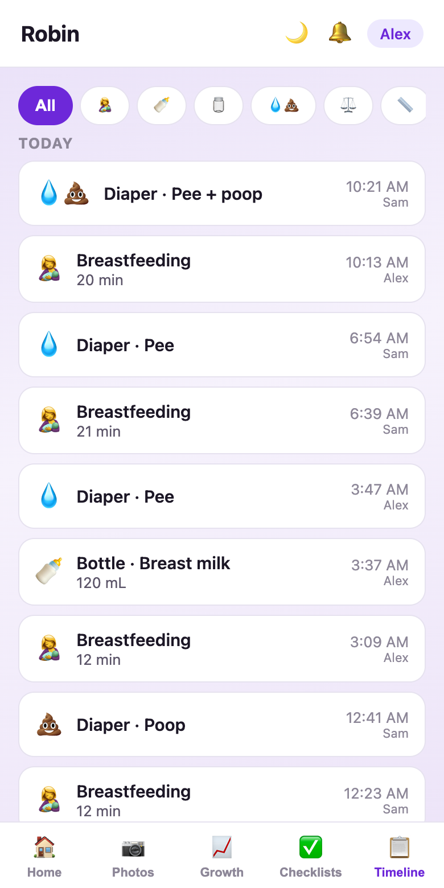
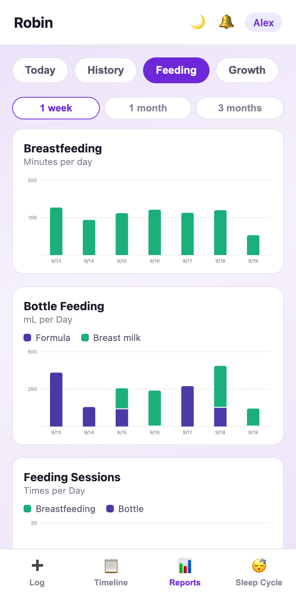
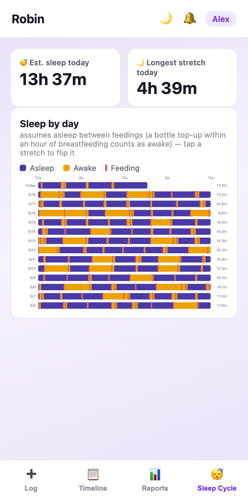

# Baby Tracker

A self-hosted PWA two caregivers use from their phones to track one baby,
from the newborn weeks (feeds, diapers, sleep, a push nudge when nothing has
been logged) through the first two years (growth percentiles, a photo
gallery, CDC milestone and vaccination checklists).

One Node.js process serves the app, owns a SQLite database, stores photos on
disk, and runs the notification timers. No accounts, no analytics, no
third-party services unless you opt into the AI extras below.

**Who it is for:** technical parents who can run a Docker image or a Fly app
and want their child's data on a machine they control. It is deliberately
single-family: two named caregivers, one baby, one shared secret.

**Not goals:** accounts or multi-family hosting, a native app, non-US
immunization or milestone schedules (the checklists are CDC/ACIP data files
and can be swapped), and translated UI. Issues asking for these will be
closed with a pointer here; forks are welcome.

## Features

- **Home** - baby's age, latest weight and percentile, milestone progress,
  and quick access to everything else. A classic Log-first layout is one
  toggle away for the newborn phase.
- **Logging** - breastfeeding, bottle (formula or expressed milk, in mL),
  pumping, diapers, weight, height, head circumference, milestones,
  vaccinations and photos. Diapers save in one tap; the bottle sheet
  pre-fills from the last bottle. Every timestamp is editable.
- **Growth** - weight, height and head-circumference charts plotted against
  the WHO 0-24 month standards (the ones US pediatricians use under age 2),
  with percentiles computed from the LMS tables for the baby's sex.
- **Checklists** - the CDC "Learn the Signs. Act Early." milestone list,
  bracketed by age off the birth date, and the CDC/ACIP immunization schedule
  with due and overdue badges. Tapping an item opens a pre-filled sheet;
  saving it records the milestone or shot as an event in the timeline.
- **Photos** - a gallery grouped by baby-month with monthly-birthday badges,
  thumbnails generated on demand, and push nudges (on by default, each with
  its own off switch, daytime only) when the gallery goes stale or a
  month-iversary arrives.
- **Timeline and Reports** - reverse-chronological entries filterable by
  type; daily feeding, diaper, pumping and appetite charts; an inferred
  sleep-cycle view built from the gaps between feeds.
- **Push notifications** - a feed nudge after N quiet hours (on by default
  at 6h; set `NUDGE_HOURS=0` to switch it off once the newborn phase passes)
  plus the photo nudges above. Web Push, no vendor account needed.
- **Voice logging** (optional) - an in-app microphone button and a Siri
  Shortcut, both parsed by Claude, in English or Mandarin.
- **Backups** - a one-request tar.gz export of the database and photos.

## Screenshots

> **All screenshots are anonymized.** Every name, date, measurement and photo
> shown is synthetic: they come from a throwaway database seeded by
> `scripts/seed-demo-data.js` plus placeholder images, never from a real
> family's data. See [Demo data](#demo-data-for-screenshots).

<table>
  <tr>
    <td width="25%"></td>
    <td width="25%"></td>
    <td width="25%"></td>
    <td width="25%"></td>
  </tr>
  <tr>
    <td align="center"><b>Home</b></td>
    <td align="center"><b>Growth</b></td>
    <td align="center"><b>Milestones</b></td>
    <td align="center"><b>Vaccines</b></td>
  </tr>
  <tr>
    <td width="25%"></td>
    <td width="25%"></td>
    <td width="25%"></td>
    <td width="25%"></td>
  </tr>
  <tr>
    <td align="center"><b>Photos</b></td>
    <td align="center"><b>Timeline</b></td>
    <td align="center"><b>Reports</b></td>
    <td align="center"><b>Sleep cycle</b></td>
  </tr>
</table>

## Privacy

This repo is public; **no personal data lives in it**. Names, emails, and the
shared login secret are supplied via environment variables (`.env` locally -
gitignored - or Fly secrets in production). The database and photos live on a
private volume, and photos are only served behind login.

## Local development

```sh
npm install
cp .env.example .env # optional - every key has a usable dev default
npm start            # http://localhost:3000
npm test             # API test suite, no config needed
```

A fresh clone boots with no other setup: the data directory and push keys
are created on first start, and the startup banner lists which optional
features are on. (`npm run make-icons` only regenerates the committed app
icon.)

Configuration is read from `.env`; `.env.example` documents every key, and the
table at the bottom of this file has the full reference. The default login
secret in dev is `baby`.

### Demo data (for screenshots)

The screenshots above were produced from a disposable instance with an
entirely synthetic database - no real data is involved at any point:

```sh
SCRATCH=/tmp/bt-demo && mkdir -p $SCRATCH
cat > $SCRATCH/demo.env <<EOF
USER_NAMES=Alex,Sam
BABY_NAME=Robin
BIRTH_DATE=2026-05-02
BABY_SEX=girl
APP_SECRET=demo
DATA_DIR=$SCRATCH/demo-data
PORT=3100
EOF
SEED_DIR=$SCRATCH/demo-data SEED_BIRTH=2026-05-02 \
  SEED_NOW=2026-07-23T15:40:00-07:00 node scripts/seed-demo-data.js
node --env-file=$SCRATCH/demo.env server/index.js   # http://localhost:3100
```

`scripts/seed-demo-data.js` generates about two months of plausible feeds,
diapers, weekly growth measurements and milestones from a seeded PRNG, so
re-running it reproduces the same screenshots. It refuses to write to a live
`DATA_DIR`, and `--env-file=` (rather than `npm start`) keeps your real
`.env` out of the demo process.

## Deploying anywhere (Docker)

A prebuilt multi-arch image is published to GitHub Container Registry on
every release, so a Raspberry Pi, a home server or any VPS with Docker can
run the app without compiling anything.

```sh
git clone https://github.com/magratheazaphod/baby-tracker && cd baby-tracker
# (or just download docker-compose.yml and .env.example into an empty folder)
cp .env.example .env   # set APP_SECRET, USER_NAMES, BABY_NAME, BIRTH_DATE,
                       # BABY_SEX and HOME_TZ at minimum
docker compose up -d
curl -s http://127.0.0.1:3000/api/health   # {"ok":true}
```

The app binds to localhost only, because the "Add to Home Screen" install
flow and Web Push notifications both require HTTPS. Put a reverse proxy with
automatic certificates in front of it. A ready-made Caddy setup is included:
point DNS at the host, replace `tracker.example.com` in
[`deploy/caddy/Caddyfile`](deploy/caddy/Caddyfile), then

```sh
docker compose -f docker-compose.yml -f docker-compose.caddy.yml up -d
```

Traefik, nginx or a Cloudflare tunnel work just as well; proxy to port 3000.

Then on each phone: open the app URL in Safari → Share → **Add to Home
Screen** → open it from the home screen → log in → tap 🔔 to enable nudges.

The named `data` volume holds the SQLite database and every photo. Back it up
the same way as any other install: `GET /api/export` or `scripts/backup.sh`
(see [Backups](#backups)). To upgrade, `docker compose pull && docker compose
up -d`; schema migrations run automatically at startup.

## Deploying to Fly.io

```sh
cp fly.toml.example fly.toml           # set your app name + region (stays local)
fly apps create your-app-name
fly volumes create data --size 1 --region <region> -a your-app-name
npx web-push generate-vapid-keys       # for push notifications
fly secrets set -a your-app-name \
  APP_SECRET="your-family-secret" \
  USER_NAMES="Mom,Dad" \
  BABY_NAME="..." \
  BIRTH_DATE="YYYY-MM-DD" \
  BABY_SEX="girl" \
  VAPID_SUBJECT="mailto:you@example.com" \
  VAPID_PUBLIC_KEY="..." \
  VAPID_PRIVATE_KEY="..."
fly deploy --ha=false
```

Then on each iPhone: open the app URL in Safari → Share → **Add to Home
Screen** → open it from the home screen → log in → tap 🔔 to enable nudges.

## Monitoring

`GET /api/health` returns `{"ok":true}` when the app is up and its database is
readable, and `503` otherwise. It runs a one-row SQLite query rather than just
confirming the process is alive - a machine whose volume failed to mount will
happily serve pages while every real request fails. It requires no login and
returns nothing personal, so it is safe to point a public monitor at.

Two things should watch it:

1. **Fly** - `fly.toml.example` includes an `[[http_service.checks]]` block that
   polls it every 30s and restarts the machine when it fails.
2. **An external uptime monitor** - [UptimeRobot](https://uptimerobot.com) or
   [Healthchecks.io](https://healthchecks.io), free tier, pointed at
   `https://your-app.fly.dev/api/health`. This is the one that actually reaches
   you: if the machine or the whole region is down, Fly's internal check has no
   way to send you an alert.

```sh
curl -s https://your-app.fly.dev/api/health   # {"ok":true}
```

## Backups

Three layers:

1. **Fly volume snapshots** - automatic, daily, 30-day retention
   (`fly volumes update <vol-id> --snapshot-retention 30`). Restore with
   `fly volumes create data --snapshot-id <id>`.
2. **Off-site export** - `GET /api/export` streams a tar.gz of the SQLite
   database + all photos. Authenticated by login cookie or
   `Authorization: Bearer <APP_SECRET>`.
3. **Pull script** - `scripts/backup.sh` downloads an export and keeps the
   newest 30 locally:
   ```sh
   APP_URL=https://your-app.fly.dev APP_SECRET=... ./scripts/backup.sh
   ```
   Run it on a schedule (cron/launchd) for continuous off-site copies.

## Voice logging (optional)

Two ways to log by voice, both parsed by Claude and both off unless you set
the keys:

- **In-app microphone button** - needs `ANTHROPIC_API_KEY` plus
  `TRANSCRIBE_API_KEY` for speech-to-text (any OpenAI-compatible
  `/v1/audio/transcriptions` endpoint; Groq by default). The button appears
  as soon as the transcription key is set, so set both or every attempt
  fails. Handles English, Mandarin, and sentences that switch between them.
- **Siri Shortcut** - `POST /api/voice` takes a dictated sentence, saves the
  events, and returns a spoken confirmation, so "Hey Siri, Log Baby" works
  hands-free. Needs `ANTHROPIC_API_KEY` plus its own `VOICE_TOKEN`
  (`fly secrets set -a your-app-name --stage VOICE_TOKEN="..."`, then
  deploy). The token is deliberately separate from `APP_SECRET` and can only
  create events, never read or export.

See [docs/siri-voice-logging.md](docs/siri-voice-logging.md) for both.

## Environment variables

| Var | Default | Purpose |
|---|---|---|
| `APP_SECRET` | `baby` (dev only) | shared login secret - set a real one in prod |
| `USER_NAMES` | `Mom,Dad` | comma-separated parent names shown at login |
| `BABY_NAME` | `Baby` | baby's name (private, env-only) |
| `APP_NAME` | falls back to `BABY_NAME` | app title + home-screen name |
| `BIRTH_DATE` | unset | baby's birth date (YYYY-MM-DD); enables growth percentiles |
| `BABY_SEX` | unset | `boy` or `girl`; selects the WHO growth-standards table |
| `HOME_TZ` | `America/Los_Angeles` | day boundaries for reports |
| `NUDGE_HOURS` | `6` | push a nudge after this many hours with no entries; `0` disables |
| `RENUDGE_MINUTES` | `60` | re-nudge interval while still quiet |
| `PHOTO_NUDGE_DAYS` | `3` | nudge for a photo after this many days with none; `0` disables |
| `MONTHLY_PHOTO_NUDGE` | `1` | monthly-birthday photo nudge (needs `BIRTH_DATE`); `0` disables |
| `PORT` | `3000` | port the server listens on |
| `DATA_DIR` | `./data` | where SQLite + photos live (`/data` on Fly) |
| `VAPID_PUBLIC_KEY` / `VAPID_PRIVATE_KEY` / `VAPID_SUBJECT` | auto-generated, persisted in `DATA_DIR` | web-push credentials; set only to survive a data wipe |
| `COOKIE_SECRET` | derived from `APP_SECRET` | cookie signing key |
| `ANTHROPIC_API_KEY` | unset | enables the auto-generated Claude analysis of diaper photos and voice logging; without it, photos still work and analysis is skipped |
| `TRANSCRIBE_API_KEY` / `TRANSCRIBE_URL` / `TRANSCRIBE_MODEL` | unset / Groq / `whisper-large-v3-turbo` | speech-to-text for the in-app mic button; unset hides the button |
| `DEMO_MODE` | unset | `1` makes the instance read-only for a public demo: login and reads work, every write, upload, push and export is refused |
| `VOICE_TOKEN` | unset | bearer token for `POST /api/voice` (hands-free Siri logging - see [docs/siri-voice-logging.md](docs/siri-voice-logging.md)); unset disables the endpoint |

## License

MIT - see [LICENSE](LICENSE). The WHO growth standards, CDC milestone
checklist and CDC/ACIP immunization schedule bundled under `public/` are
public reference data from their respective publishers, not covered by this
license. Screenshots under `docs/screenshots/` are synthetic demo captures
and may be reused under the same MIT terms.
